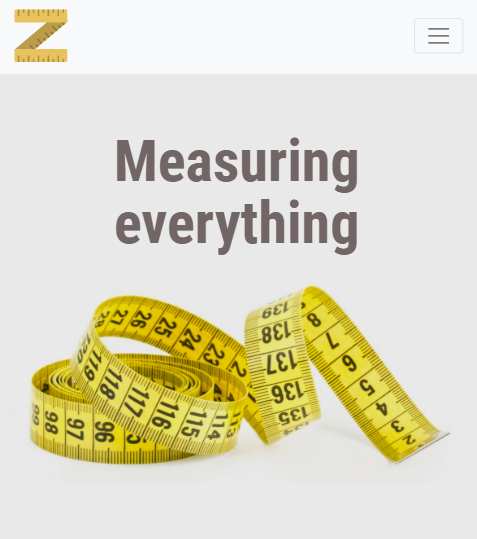
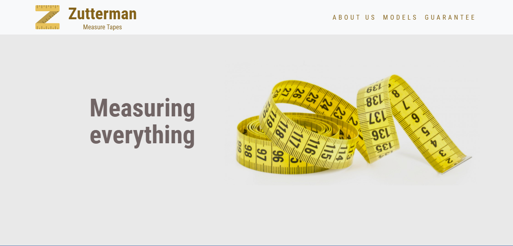

<p align="center">
    
</p>

<p align="center">
    


<a href="https://www.linkedin.com/in/alquiponeto/">
    
</a>

<a href="https://github.com/Alquipo/Desafio-Calindra-FrontEnd-Zutterman/commits/master">
    
</a>


<a href="https://app.netlify.com/sites/zutterman/deploys">
    
</a>

## 🚀 Sobre o desafio

Dado o layout fornecido disponível no link abaixo, desenvolver o layout, observando as
práticas de semântica e responsividade, com boas práticas de utilização dos recursos, sejam CSS,
JS, etc. Você poderá pedir qualquer tipo de recurso extra para o site (ex. fontes, vetores entre
outras coisas que achar necessário).

## 🎨 Layout

<p align="center">

  
  
  
</p>

<div align="center">

<button><a target="_blank" href="https://www.zutterman.alquipo.dev/"></img></a></button>

</div>

## 🔨 Tecnologias:

- [HTML 5](https://www.w3schools.com/html/default.asp)
- [CSS 3](https://www.w3schools.com/css/)
- [Bootstrap 4](https://getbootstrap.com/)

## 🚀 Como rodar este projeto

Para clonar e executar este aplicativo, você precisará de [Git](https://git-scm.com) instalado em seu computador.

### 🌀 Clonando o repositório

```bash
# Clone este repositório
$ git clone https://github.com/Alquipo/Desafio-Calindra-FrontEnd-Zutterman

# Acesse a pasta do projeto no terminal/cmd
$ cd Desafio-Calindra-FrontEnd-Zutterman

```

### 🧭 Rodando a aplicação web

```bash
Executar o arquivo index.html
```

## 🤔 Como contribuir para o projeto

- Faça um **fork** do projeto;
- Crie uma nova branch com as suas alterações: `git checkout -b my-feature`
- Salve as alterações e crie uma mensagem de commit contando o que você fez:`git commit -m "feature: My new feature"`
- Envie as suas alterações: `git push origin my-feature`

> Caso tenha alguma dúvida confira este [guia de como contribuir no GitHub](https://github.com/firstcontributions/first-contributions)

## 📝 Licença

Este projeto esta sobe a licença MIT. Veja a [LICENÇA][license] para saber mais.

Feito com ❤️ por Alquipo Neto 👋🏽 [Entre em contato!](https://www.linkedin.com/in/alquiponeto/)

[reactjs]: https://reactjs.org/
[nodejs]: https://nodejs.org/en/
[rs]: https://rocketseat.com.br
[license]: https://opensource.org/licenses/MIT
[desafio2]: https://github.com/Alquipo/GoStack12-desafio-02
[typescript]: https://www.typescriptlang.org/
